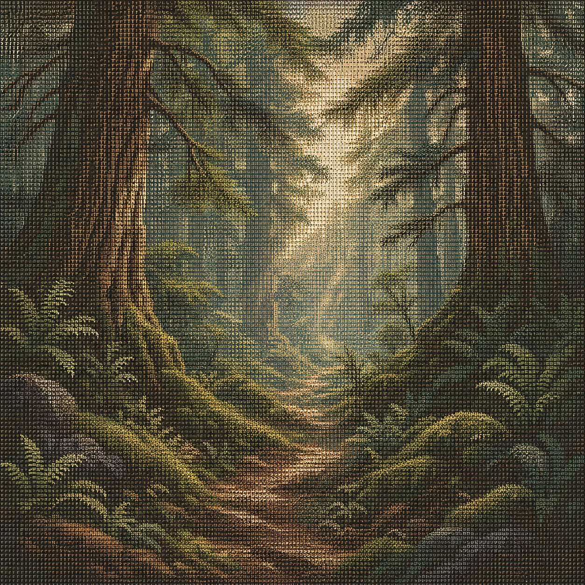
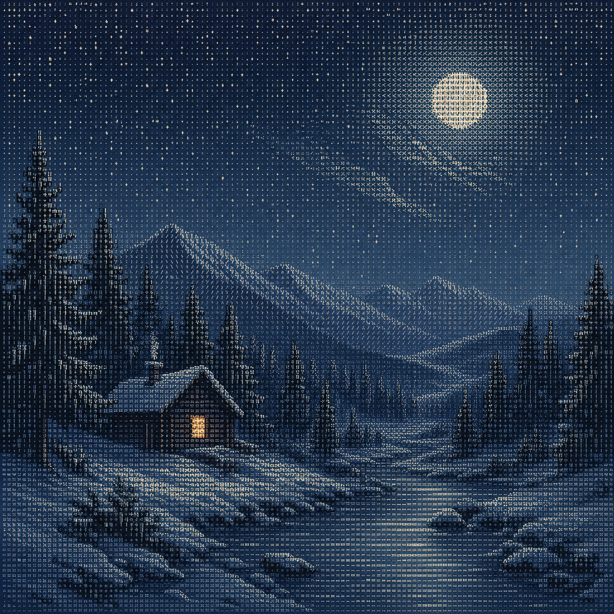
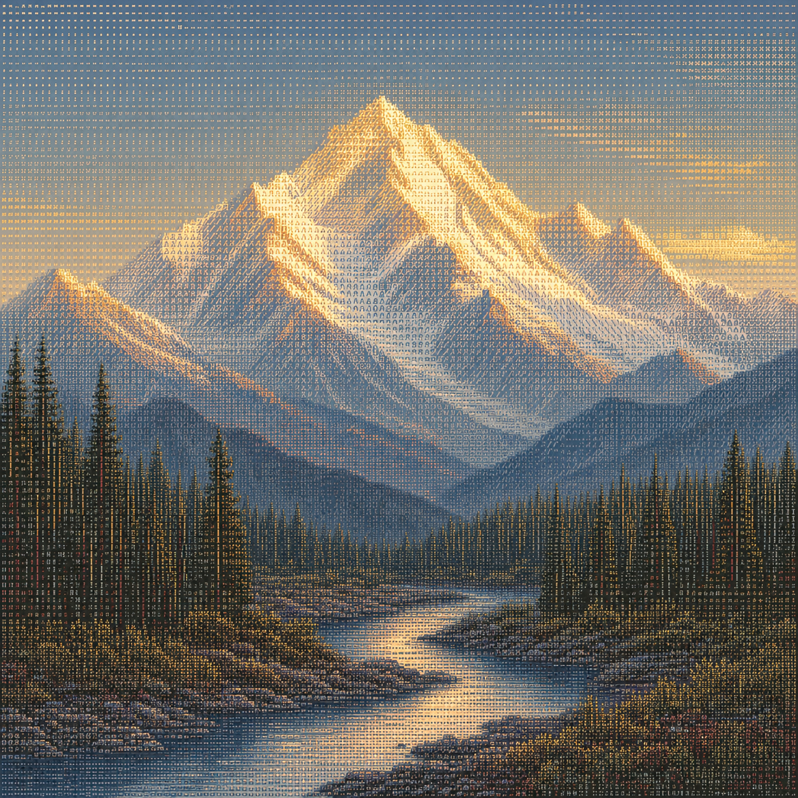

# Image Skills

[**English**](./README.md) | [简体中文](./README.zh-CN.md)

[](https://skills.sh/fine405/skills)

Reusable image-generation workflows for cross-platform app icons, transparent raster assets, code-ready ANSI terminal art, and painterly full-color glyph mosaics.

## Available skills

| Skill | Purpose | Install |
| --- | --- | --- |
| [`app-icon-design`](./skills/app-icon-design/) | Design, generate, critique, and prepare one app-icon identity for Apple, Android, Web/PWA, Windows, and other targets through independent platform and style modules. | `npx skills add fine405/skills --skill app-icon-design` |
| [`imagegen-transparent`](./skills/imagegen-transparent/) | Generate or extract clean transparent PNG/WebP assets with chroma-key removal, soft alpha matting, despill, and validation. | `npx skills add fine405/skills --skill imagegen-transparent` |
| [`imagegen-ansi`](./skills/imagegen-ansi/) | Convert references or generated raster art into transparent ANSI-style assets, terminal half-block output, and executable JavaScript previews. | `npx skills add fine405/skills --skill imagegen-ansi` |
| [`imagegen-glyph-mosaic`](./skills/imagegen-glyph-mosaic/) | Analyze visual references and generate full-color glyph-mosaic illustrations with a coherent character grid, directional glyph logic, and adjustable palette roles. | `npx skills add fine405/skills --skill imagegen-glyph-mosaic` |

## ImageGen Transparent

Use Codex ImageGen or a compatible image generator to create a controlled chroma-key source, then remove the background locally and validate the result.

### Workflow

1. Choose a key color absent from the subject, normally `#00ff00`.
2. Generate the subject on an exact, flat key background with no shadows or reflections.
3. Sample the actual border color and build a soft alpha matte.
4. Remove key-color spill and optionally contract the edge by 1 px.
5. Validate RGBA mode, transparent corners, subject coverage, clipping, and edge quality.

### Snowflake sprite-sheet example

The example recreates four supplied snowflake forms, adds twelve common snow-crystal forms, and produces a ranked 4×4 transparent sprite sheet.

| Generated chroma-key source | Validated transparent output |
| --- | --- |
|  |  |
| 1254×1254 RGB source | 1256×1256 RGBA output with 314×314 cells |

## ImageGen ANSI

Use direct alpha conversion when a source already has a clean silhouette. Use ImageGen when the request needs a deliberate terminal-cell reinterpretation, then derive both the raster asset and executable terminal renderer from the same sampled bitmap.

### Workflow

1. Inspect the reference and preserve its silhouette, proportions, spacing, and exact text when present.
2. Generate white terminal-cell geometry on a flat removable key background.
3. Extract and validate a transparent RGBA raster.
4. Sample its alpha channel and pack two vertical pixels into `█`, `▀`, and `▄`.
5. Preview directly in the terminal or emit an executable `.mjs` module.

### Mountain-and-sun example

This example uses an original, generic mountain-and-rising-sun badge with no text or brand identity.

1. Generate a flat reference badge.
2. Reinterpret it as coarse white ANSI cell geometry on `#00ff00`.
3. Sample the generated border (`#03ed0b`), remove it, and validate four transparent corners.
4. Convert the alpha mask to a 48×50 bitmap and 25 terminal rows.
5. Emit both plain ANSI text and an adaptive JavaScript renderer.

Prompt summary:

> Preserve the generic circular badge, two mountain peaks, and rising sun while translating all curves into deliberate terminal-cell steps. Render pure white on a perfectly flat green key background with no text, brand identity, shadows, gradients, or decoration.

<table>
  <thead>
    <tr>
      <th>Original reference</th>
      <th>Generated chroma-key ANSI art</th>
      <th>Validated transparent ANSI art</th>
    </tr>
  </thead>
  <tbody>
    <tr>
      <td></td>
      <td></td>
      <td bgcolor="#0d1117"></td>
    </tr>
  </tbody>
</table>

Run the code-generated terminal preview:

```bash
node ./skills/imagegen-ansi/examples/mountain-sun-ansi.mjs
```

The corresponding plain-text output is available at [`mountain-sun-ansi.txt`](./skills/imagegen-ansi/examples/mountain-sun-ansi.txt).

## ImageGen Glyph Mosaic

Use style references to separate stable visual DNA from adjustable subject and palette variables, then generate painterly raster scenes whose image-forming marks remain visible monospaced glyphs.

### Workflow

1. Label supplied images as style references or edit targets.
2. Extract the stable grid, dual-scale readability, directional glyph logic, restrained palette, and print surface.
3. Keep subject, composition, weather, and palette roles adjustable.
4. Generate each distinct scene with its own prompt while reusing the same style core.
5. Validate the result both as a small coherent scene and as a close-up character grid.

### Polychrome glyph-mosaic examples

All three examples use the same style core with scene-specific composition and palette-role blocks. They are original outputs generated for this skill.

| Forest | Snow night | Golden mountain |
| --- | --- | --- |
|  |  |  |
| Moss, dusty teal, ochre, and ivory | Indigo, icy blue-gray, cream, and restrained amber | Powder blue, glacier ivory, warm gold, and deep umber |

The reusable template is in [`references/prompt-template.md`](./skills/imagegen-glyph-mosaic/references/prompt-template.md), and the example scene prompts are in [`examples/prompts.md`](./skills/imagegen-glyph-mosaic/examples/prompts.md).

## App Icon Design

Build one recognizable product identity, then adapt it to each target without mixing platform specifications into visual-style rules.

### Workflow

1. Reduce the app to an audience, core job, promise, category cue, and differentiator.
2. Lock an identity invariant: metaphor, silhouette, proportions, brand-color role, and one signature detail.
3. Load only the requested platform modules for Apple, Android, Web/PWA, or Windows.
4. Apply an installed style module or a task-local style brief; bundled styles include soft neumorphism and discomorphism.
5. Generate or edit the artwork, test target masks and small sizes, and report remaining packaging steps honestly.

New visual directions are added as independent `style-*.md` modules, so platform adapters and the core workflow remain unchanged.

## Compatibility and requirements

- Codex's built-in ImageGen is the default generator; another authorized generator may be used when it preserves the active skill's prompt constraints, reference roles, and local output workflow.
- Chroma-key extraction and ANSI conversion require Python 3 and [Pillow](https://pillow.readthedocs.io/); glyph-mosaic generation has no additional local runtime dependency.
- App-icon concept work has no additional local runtime dependency; production handoff requires checking the current official requirements for every target platform.
- Each skill includes `agents/openai.yaml` with Codex-facing display metadata.

## Repository structure

```text
skills/
├── app-icon-design/
│   ├── SKILL.md
│   ├── agents/openai.yaml
│   └── references/
│       ├── platform-android.md
│       ├── platform-apple.md
│       ├── platform-web.md
│       ├── platform-windows.md
│       ├── module-style-template.md
│       ├── style-discomorphism.md
│       └── style-soft-neumorphic.md
├── imagegen-ansi/
│   ├── SKILL.md
│   ├── agents/openai.yaml
│   ├── scripts/
│   │   ├── raster_to_ansi.py
│   │   └── remove_chroma_key.py
│   └── examples/
│       ├── mountain-sun-reference.png
│       ├── mountain-sun-ansi-chroma.png
│       ├── mountain-sun-ansi.png
│       ├── mountain-sun-ansi.txt
│       └── mountain-sun-ansi.mjs
├── imagegen-glyph-mosaic/
│   ├── SKILL.md
│   ├── agents/openai.yaml
│   ├── references/prompt-template.md
│   └── examples/
│       ├── prompts.md
│       ├── forest.png
│       ├── snow-night.png
│       └── golden-mountain.png
└── imagegen-transparent/
    ├── SKILL.md
    ├── agents/openai.yaml
    ├── scripts/remove_chroma_key.py
    └── examples/
        ├── snowflake-sprite-sheet-chroma.png
        └── snowflake-sprite-sheet.png
```

## License

MIT
