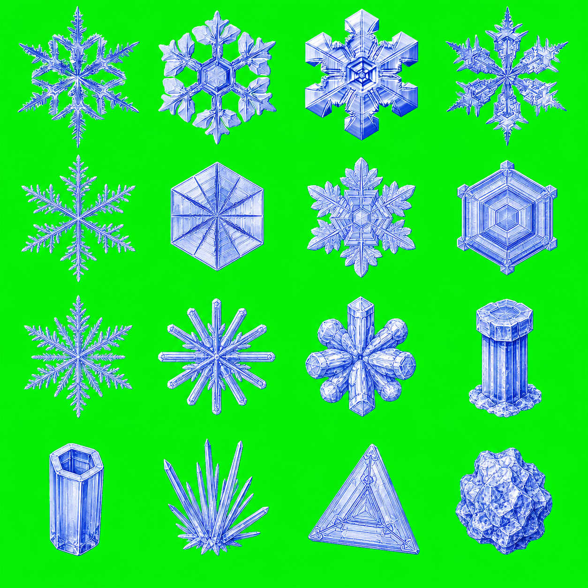
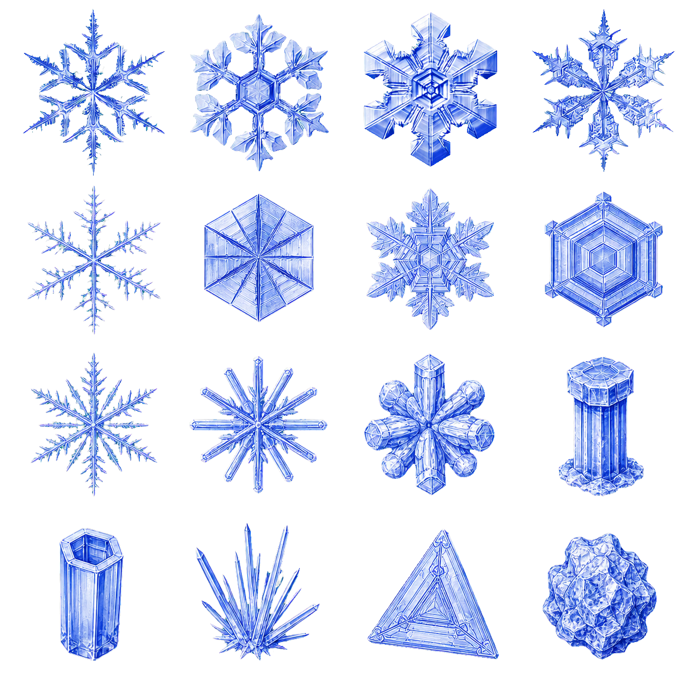

# 图像 Skills

[English](./README.md) | [**简体中文**](./README.zh-CN.md)

[](https://skills.sh/fine405/skills)

用于生成透明栅格素材和可用代码复刻的 ANSI 终端字符画。

## 可用 Skills

| Skill | 用途 | 安装 |
| --- | --- | --- |
| [`imagegen-transparent`](./skills/imagegen-transparent/) | 使用色键移除、柔和 Alpha 蒙版、去溢色和结果校验，生成或提取干净的透明 PNG/WebP。 | `npx skills add fine405/skills --skill imagegen-transparent` |
| [`imagegen-ansi`](./skills/imagegen-ansi/) | 将参考图或生成的栅格图转换为透明 ANSI 风格素材、终端半块字符输出和可执行 JavaScript 预览。 | `npx skills add fine405/skills --skill imagegen-ansi` |

## ImageGen Transparent

使用 Codex ImageGen 或兼容的图像生成工具创建可控的色键源图，再在本地移除背景并校验结果。

### 工作流程

1. 选择主体中不存在的色键颜色，通常使用 `#00ff00`。
2. 在精确、平坦的色键背景上生成主体，不包含阴影或反射。
3. 采样实际边框颜色并构建柔和的 Alpha 蒙版。
4. 移除色键溢色，并可选择将边缘向内收缩 1 px。
5. 验证 RGBA 模式、四角透明度、主体覆盖率、裁切情况和边缘质量。

### 雪花雪碧图示例

示例复刻了提供的四种雪花形态，补充十二种常见雪晶，并生成按照视觉效果排序的 4×4 透明雪碧图。

| 生成的色键源图 | 验证后的透明图 |
| --- | --- |
|  |  |
| 1254×1254 RGB 源图 | 1256×1256 RGBA 输出，每个单元格为 314×314 |

## ImageGen ANSI

如果源图已经具有干净轮廓，优先直接转换 Alpha；如果需要明确的终端单元格再设计，则使用 ImageGen。透明图片和可执行终端渲染器都由同一份采样点阵派生。

### 工作流程

1. 检查参考图；保留轮廓、比例、间距，以及文字存在时的准确拼写。
2. 在可移除的纯色色键背景上生成白色终端单元格几何。
3. 提取并校验透明 RGBA 栅格图。
4. 采样 Alpha 通道，并使用 `█`、`▀` 和 `▄` 将两个垂直像素压缩到一行终端字符。
5. 在终端直接预览，或生成可执行的 `.mjs` 模块。

### 山峰与日出示例

这个示例使用完全原创、没有文字和品牌身份的通用“山峰与日出”徽章。

1. 生成平面参考徽章。
2. 将其重新解释为 `#00ff00` 背景上的粗粒度白色 ANSI 单元格几何。
3. 采样生成后的边框颜色（`#03ed0b`），移除背景并确认四角完全透明。
4. 将 Alpha 蒙版转换为 48×50 点阵和 25 行终端输出。
5. 同时生成纯字符画和能够自适应终端宽度的 JavaScript 渲染器。

提示词摘要：

> 保留通用圆形徽章、两座山峰和升起的太阳，将所有曲线转换为明确的终端单元格阶梯。主体使用纯白色，背景使用完全平坦的绿色色键；不包含文字、品牌身份、阴影、渐变或额外装饰。

<table>
  <thead>
    <tr>
      <th>原创参考图</th>
      <th>生成的 ANSI 色键图</th>
      <th>验证后的透明 ANSI 图</th>
    </tr>
  </thead>
  <tbody>
    <tr>
      <td></td>
      <td></td>
      <td bgcolor="#0d1117"></td>
    </tr>
  </tbody>
</table>

运行代码生成的终端预览：

```bash
node ./skills/imagegen-ansi/examples/mountain-sun-ansi.mjs
```

对应的纯文本输出位于 [`mountain-sun-ansi.txt`](./skills/imagegen-ansi/examples/mountain-sun-ansi.txt)。

## 兼容性与依赖

- 默认使用 Codex 内置 ImageGen；经过授权的其他生成工具只要能够生成均匀色键的本地栅格图，也可以接入。
- 背景提取和 ANSI 转换需要 Python 3 与 [Pillow](https://pillow.readthedocs.io/)。
- 两个 skill 的 [`agents/openai.yaml`](./skills/imagegen-ansi/agents/openai.yaml) 与 [`agents/openai.yaml`](./skills/imagegen-transparent/agents/openai.yaml) 提供面向 Codex 的展示元数据。

## 仓库结构

```text
skills/
├── imagegen-ansi/
│   ├── SKILL.md
│   ├── agents/openai.yaml
│   ├── scripts/
│   │   ├── raster_to_ansi.py
│   │   └── remove_chroma_key.py
│   └── examples/
│       ├── mountain-sun-reference.png
│       ├── mountain-sun-ansi-chroma.png
│       ├── mountain-sun-ansi.png
│       ├── mountain-sun-ansi.txt
│       └── mountain-sun-ansi.mjs
└── imagegen-transparent/
    ├── SKILL.md
    ├── agents/openai.yaml
    ├── scripts/remove_chroma_key.py
    └── examples/
        ├── snowflake-sprite-sheet-chroma.png
        └── snowflake-sprite-sheet.png
```

## 许可证

MIT
